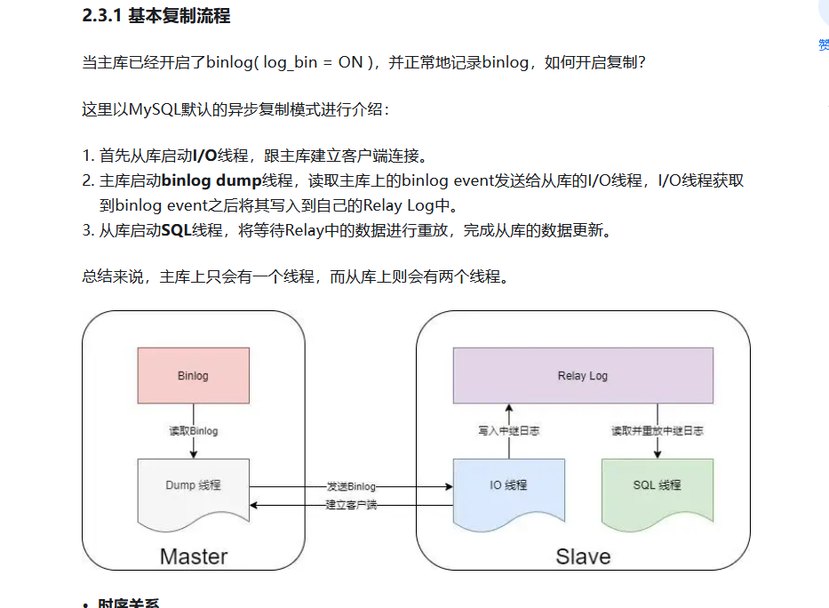

[TOC]

# mysql

## 为什么mysql使用B+树

> 索引的核心作用是减少查询的io, 要尽量减少查询层数和次数
>
> * 二叉树在针对递增数据时会一直往右排，使得索引退化成单向链表。
> * 红黑树的高度平衡, 数据量大了后会导致树层级过多
> * B+树 非叶子节点不存储数据， 在定位时减少不必要的io,

## 为什么推荐单表不超过2000万行

>B+树  每页数据大约16K ,   1K 存储 File Header (38 byte)、Page Header (56 Byte)、Infimum + Supermum（26 byte）、File Trailer（8byte） 
>
>实际数据一个节点（键值 （BIGINT 8 位）+ 地址（4位））
>
>一行节点可存储 15* 1024/ 12 约等于1280行
>
>3层B+，按一行数据1K计算，   1280* 1280 * 16K  约等于 2300w 
>
>较少io, 不要超过3层
>
>
>
>Mysql 的表数据是以页的形式存放的，页在磁盘中不一定是连续的。
>
>页的空间是 16K, 并不是所有的空间都是用来存放数据的，会有一些固定的信息，如，页头，页尾，页码，校验码等等。
>
>在 B+ 树中，叶子节点和非叶子节点的数据结构是一样的，区别在于，叶子节点存放的是实际的行数据，而非叶子节点存放的是主键和页号。
>
>索引结构不会影响单表最大行数，2kw 也只是推荐值，超过了这个值可能会导致 B + 树层级更高，影响查询性能。
>
>

## MVCC

> 多版本并发控制
> 在并发事务下，可能会产生如下问题：
>  1.脏读 ：当前事务读取到其它事务未提交的数据。
>  2.脏写 ： 事务B提交后，将事务A提交的数据覆盖。
>  3.不可重复读：在同一个事务中，不同时间段执行相同的查询语句，得到的结果集不相同。
>  4.幻读：事务A读取到了事务B新增的数据。
>
> 1、MVCC在不加锁的情况下，解决了并发事务的脏读、脏写不可重复度等问题，而幻读可以使用间隙锁进行解决。
> 2、undo log里面通过两个隐藏字段trx_id、roll_pointer将历史快照数据串联起来，形成一个版本链，是read view获取数据的前提。
> 3、read view是在第一次查询时生成的，由所有未提交的活跃事务id组成的数组和最大事务id构成。
> 4、通过对比事务id的大小，将数据进行展示。

## 索引分类

> BTree 和 哈希
>
> 一般默认使用BTree，因为哈希不支持范围查询 且无法快速排序

## 主从复制原理

> 主数据库的操作生成binlog ， 
>
> 
